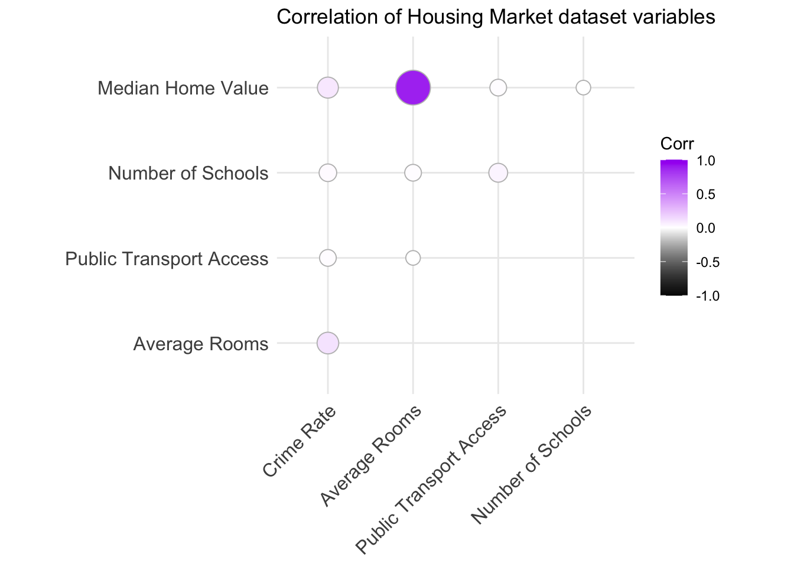
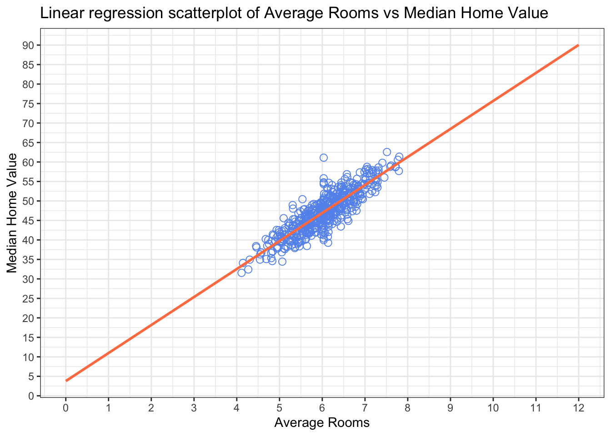
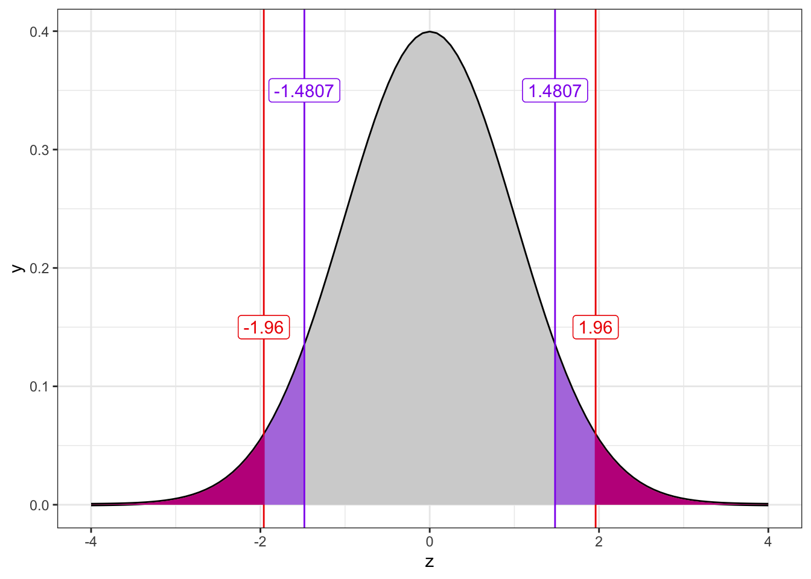

# Data Science Notebooks in R

This repository contains `R` notebooks related to brief _Data Science_ projects in various topics.

  * [Housing Market](#housing-market)

## Housing Market

In this notebook, I explored and analysed neighborhood related housing market data to:

  * infer about `target variable` of neighborhood _median home value_
  * find a **strong predictor** variable using `correlation` to explore possible `linear relationship` between the target and any other given variable
  * create a model to **predict** target variable based on the strong predictor variable using `linear regression`
  * conduct a `hypothesis test` on whether there is a **statistically significant difference** in the target variable considering _low_ and _high crime rate neighborhoods_

The complete notebook is published in a readable format [here](https://rpubs.com/matthew-balogh/housing-market-data-analysis).

It is important to mention that this notebook has been created with the intention to not only utilize _Data Science_ techniques but to practice the `R` language. Therefore, this notebook includes all the code chunks related to the analysis.

To get an overview of the analysis, few of the important findings are included here as follows:

### Correlation Matrix

According to the correlation matrix, the variable of _average rooms_ turned out to be a strong linear predictor ($R=0.889, \ R^2=0.79$) for _median home value_.

### Linear Regression

A linear regression model has been created based on the _average rooms_ predictor to predict _median home value_ in a linear fashion.

$$
y(x)=3785.4+(7188.6\times{𝑥})
$$

$$
\text{MedianHomeValue}(\text{AverageRooms})=3785.4+(7188.6\times{\text{AverageRooms}})
$$

The regression equation exhibits a positive intercept and slope. According to them, each additional _(average) room_ results in a $ $7188.6$ increase in _(median) home value_.

### Hypothesis Test

It has been shown that there is no statistically significant difference in the _median home value_ variable considering _low_ and _high crime rate neighborhoods_.

To arrive at this conclusion, a two-sided, two-sample hypothesis test has been conducted with a Confidence Level of 95%.

$$
H_0: \ \text{There is no difference between the median home values of high and low crime-rate neighborhoods.}
$$

$$
H_A: \ \text{There is a difference between the median home values of high and low crime-rate neighborhoods.}
$$

Considering the sufficiently large sample size ($n\approx{250}$) for each subgroup of neighborhoods, the standard normal distribution has been utilized to determine the z-scores associated with the Confidence Interval, within which the null hypothesis would not be rejected.

The conclusion has been derived from the following diagram, which depicts that the z-scores associated with the observed difference of the two samples fall within the Confidence Interval and not within any of the Rejection Areas.

That is, we attribute the observed difference solely to chance rather than a statistically significant observation.

