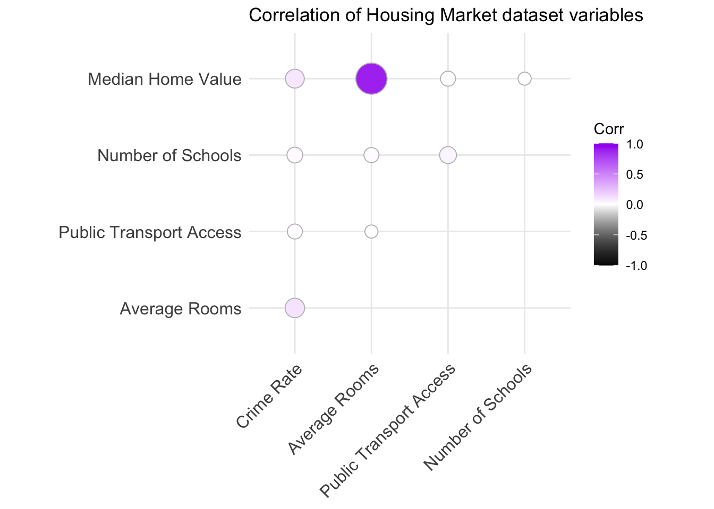

# Data Science Notebooks in R

This repository contains `R` notebooks related to brief _Data Science_ projects in various topics.

## Housing Market

In this notebook, I explored and analysed neighborhood related housing market data to:

  * infer about `target variable` of neighborhood _median home value_
  * find a **strong predictor** variable using `correlation` to explore possible `linear relationship` between the target and any other given variable
  * create a model to **predict** target variable based on the strong predictor variable using `linear regression`
  * conduct a `hypothesis test` on whether there is a **statistically significant difference** in the target variable considering _low_ and _high crime rate neighborhoods_

The complete notebook is published in a readable format [here](https://rpubs.com/matthew-balogh/housing-market-data-analysis).

It is important to mention that this notebook has been created with the intention to not only utilize _Data Science_ techniques but to practice the `R` language. Therefore, this notebook includes all the code chunks related to the analysis.

To get an overview of the analysis, few of the important findings are included here as follows:

### Correlation Matrix

